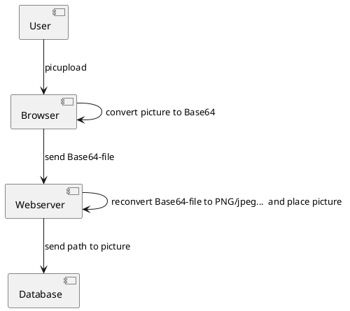

# Tag 4

## Zusamenfassung der Lektion

Wir haben den Unterricht damit begonnen, untereinander die Hausaufgaben zu sichten. Daraufhin haben wir noch in einem Plenum über die unterschiedlichen Methoden gesprochen und uns dabei 3 Lösungen von der Klasse angesehen. Daraufhin haben wir in Gruppen abgesprochen was die unterschiedlichen Variablen ausgeben werden in einem Echo, um klarer festzuhalten, wie Variablennamen funktionieren bei PHP. Zusätzlich haben wir auch nochmals festgehalten, worin sich [``==``](../tech/unterschied_==_===.md) und [``===``](../tech/unterschied_==_===.md) unterscheiden. Zum Schluss haben wir nochmals [``Client Side Rendering``](../tech/csr_ssr.md) und [``Server Side Rendering``](../tech/csr_ssr.md) besprochen und auch die Aufgabe erhalten ein [``Client Side Rendering``](../tech/csr_ssr.md) in einem Diagramm darzustellen.

<!-- tabs:start -->

#### **Behandelte Inhalte**

- Plenum Hausaufgaben
- Variablennamen übungen
- [CSR und SSR](../tech/csr_ssr.md)
- [Aufgabe Diagramm CSR](../tech/csr_ssr.md)

#### **Merksätze**

- PHP stellt Variablen dar, selbst wenn Sie sich in einem String befinden.
- Variablen werden nach einem ``$`` nicht direkt folgend mit einer Zahl betitelt ~~$1Beispiel~~. Erlaubt ist eine Bezifferung später zu setzen ``$Beispiel1``.
- Bei PHP Mathe werden bei Lösungen der selbige Datentyp gesetzt wie bei den Variablen die verwendet wurden.
- Um Dateien Inhalt anzufügen mittels ``file_put_contents`` muss das dritte Argument ``FILE_APPEND`` hinzugefügt werden. Sonst wird der bestehende Inhalt der Datei verloren gehen.

#### **Hausaufgaben**

- Erstellen Sie ein [Diagramm](../tech/csr_ssr.md) für das CSR verfahren
- Lesen Sie die Abschnitte [```Dateien lesen```](../tech/dateien_lesen.md) und [```Datein schreiben```](../tech/dateien_schreiben.md) und machen Sie dazu Notizen in der Lerndoku
- Erweitern Sie das CSR-Projekt um die Funktion, dass die dargestellten Elemente aus einer [Datei lesen](../tech/dateien_schreiben.md) kann

#### **Projekt**

In dieser Woche konnte ich mich meinem Projekt nicht gross widmen. Ich konnte lediglich in Erfahrung bringen, wie ich den Ablauf beim Speichern und Übermitteln der Bilder vorgehen soll.



<!-- tabs:end -->