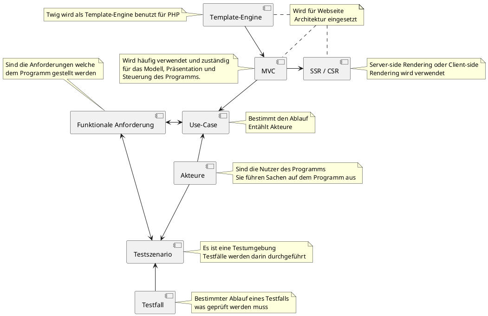

# Concept Map

## Begriffe

- [SSR / CSR](tech/csr_ssr.md)
- [MVC](tech/mvc.md)
- [Template-Engine(Twig)](tech/twig.md)
- [Use-Case](tech/use_cases.md)
- [Akteure](tech/akteure.md)
- [Funtionale Anforderungen](tech/anforderungen.md)
- [Testszenario](tech/testszenarios.md)
- [Testfall](tech/testfall.md)

