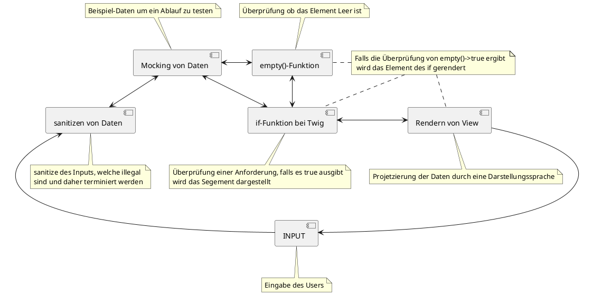

# Concept Map

## Begriffe

- [if-Funktion bei Twig](tech/twig.md)
- [if-Funktion bei Vue](projekt/vue_js.md)
- [Mocking von Daten](tech/mocking.md)
- [Rendern von View](tech/rendern.md)
- [empty()-Funktion](tech/emptyFunktion.md)
- [sanitizen von Daten](tech/sanitizen.md)

