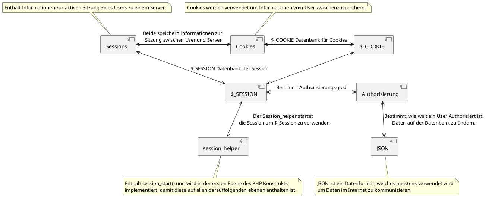

# Concept Map

## Begriffe

- [Sessions](tech/sessions_cookies.md)
- [Cookies](tech/sessions_cookies.md)
- [$_COOKIE](tech/sessions_cookies.md)
- [$_SESSION](tech/sessions_cookies.md)
- session_helper.php
- [Authorisierung (Routen schützen)](tech/sessions_cookies.md)
- JSON (in Datenbank)

