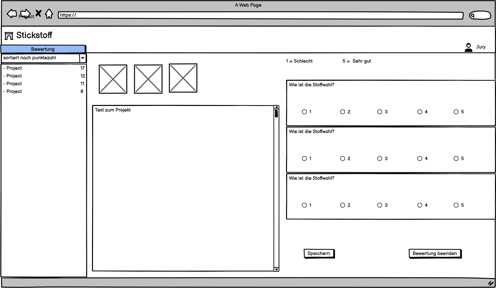

# Aufgabenstellung Onlineversion Gewinnspiel

## Ausgangslage

Das Gewinnspiel wird zweimal im Jahr durchgeführt. Die Teilnehmenden reichen passend zur jeweiligen Aufgabenstellung, Fotos von Projekten und Beschreibungen dazu ein. Bisher schreiben sie eine Mail und hängen Fotos im .jpg-Format oder PDF's an.

Derzeit erfasst wird aus den Mails:

- Das Mailanschreiben
- Die Anlagen (Fotos etc.)
- Pro Teilnehmenden wird ein Ordner angelegt (numerische Sortierung)
- Manuell wird eine Excelliste mit den Kontaktdaten angelegt (nummeriert wie die Ordner). Folgende Daten sind hier enthalten: Name, Vorname, Strasse, Land, Mailadresse, ggf. Insta-Name, Facebook-Name

Nach Ablauf des Einsendeschlusses werden alle Fotos und die anonymisierten Anschreiben in die Bewertungstabelle übertragen (siehe Excelliste anbei). Diese wird an die Jurymitglieder zur Bearbeitung versandt.

Nach Abschluss der Bewertung schreiben wir alle Teilnehmenden (Gewinner und Nichtgewinner) an anhand der Daten aus der Adress-Excelliste.

Manuell werden ausgewählte Fotos und Auszüge aus den Texten in eine Bildergalerie auf ******* hochgeladen.

## Use Cases

| ID   | Use Case                       | Auslöser | Beschreibung   | Akteur | Vorbedingungen | Nachbedingungen |
|------|--------------------------------|----------|----------------|--------|----------------|----------------|
| UC01 | **Teilnahme Wettbewerb** | Person will am Wettbewerb teilnehmen | 1. Aufruf der Seite  2. Ausfüllen Formular   3. Absenden der Daten   4. E-mail verifizierung bestätigen 5. Teilnehmende/r erhält Passwort zum anmelden | Teilnehmende | Wettbewerb ist in der Einsendungsphase | Teilnehmende/r hat erfolgreich sein Projekt für den Wettbewerb hochgeladen |
| UC02 | **Optional: Teilnehmende können ihr Projekt anpassen** | Teilnehmender möchte eine Änderung an seinem Projekt machen | 1. Ladet andere Bilder Hoch oder ändert die Beschreibung seines Projekts.   2. Speichert die Änderungen | Teilnehmende | **UC01**  Teilnehmende/r ist angemeldet | Änderungen konnten erfolgreich gespeichert werden |
| UC03 | **Jurymitglieder erstellen** | Der Admin will ein Jurymitglied erstellen | 1. Der Admin erstellt ein Jurymitglied Jurymitglied erhält eine Mail mit zugangsdaten | Admin, Jury | vorhandene Mailadresse als Admin angemeldet | Jurymitglied kann sich anmelden |
| UC04 | **Userverwaltung** | Der Admin will Userdaten anpassen | 1. Admin wählt User aus 2. Admin ändert Daten und speichert diese | Admin | als Admin angemeldet | Daten wurden gespeichert |
| UC05 | **Passwortreset** | Der Admin will Passwort zurücksetzen von User | 1. Admin wählt User aus 2. Admin setzt Passwort zurück 3.User erhält per Mail Zugangsdaten | Admin | als Admin angemeldet | Passwort wurde neu generiert und gespeichtert. |
| UC06 | **Export von Daten** | Der Admin möchte Daten exportieren | Der Admin kann hochgeladen Daten exportieren | Admin | Daten sind vorhanden als Admin angemeldet | Daten wurden exportiert |
| UC07 | **Projekte anonymisieren** | Admin will Projekte anonymisieren | 1. Admin wählt Projekt aus 2. Admin anonymisiert Daten 3. Admin Speichert die Änderung | Admin | Einsendungsphase beendet als Admin angemeldet | Änderungen wurden gespeichert |
| UC08 | **Neuer Wettbewerb** | Der Admin möchte ein neuen Wettbewerb starten | 1.Der Admin initalisiert neuen Wettbewerb 2. Admin passt Titel/Texte von neuen Wettbewerb an.  Admin bestimmt Zeitraum.  Admin speichert die Änderungen | Admin | alter Wettbewerb ist abgeschlossen als Admin angemeldet | Neuer Wettbewerb wurde bereitgestellt |
| UC09 | **Jury erhält Zugangsdaten** | Admin erstellt Jurymitglied | Ein Jurymitglied erhält seine Zugangsdaten per E-Mail | Admin, Jury | **UC03** | Jurymitglied kann sich anmelden |
| UC11 | **Jury Bewertung** | Ein Jurymitglied will Projekte bewerten | Jurymitglied kann Projekte online bewerten | Jury | **UC09** als Jury angemeldet | Bewertung wird gespeichert |

## Funktionale Anforderungen

| ID    | Funktionale Anforderung      | ID-UseCase  | Auslöser | Beschreibung   | Akteur |
|-------|------------------------------|-------------|----------|----------------|--------|
| FA01 | **Aufruf Formular** | **UC01** | Aufruf der Seite | Bein Aufruf der Wettbewerbseite wird ein leeres Formular dargestellt. | Teilnehmende |
| FA02 | **Bildupload** | **UC01** | Klick auf Button durchsuchen / optional: Drag and Drop | Bilder wird hochgeladen um vom Frontend zu Base64 umkoodiert um es später zu versenden | Teilnehmende |
| FA03 | **Teilnahme Wettbewerb** | **UC01** | Button Senden | Die Daten welche im Formular festgehalten wurden und die umkoodierten Bilder werden ans Backend-API gesendet. Das Backend koodiert Den Base64 code wieder zu Bilder um legt ein neues Verzeichniss an indem die Bilder gespeichert werden, der Pfad zu den Bildern wird in der Datenbank gespeichert. Alle anderen Informationen werden benfalls sauber auf der Datenbank hinterlegt. Auf die E-mail wird eine Verifizierung-Mail entsendet mit automatisch generiertem Login (E-mail/Passwort) wie auch zugleich eine Informationsmail an den Admin | Teilnehmende |
| FA04 | **Optional: Aufruf Projekt** | **UC02** | Login auf der Webseite als Teilnehmende/r | Nach dem Einlogen, wird das Projekt des Teilnehmers vom Backend angefoddert. Das Backend holt sich die Daten von der Datenbank schreibt die Bilder zu Base64 um und versendet diese an die Frontend-API. Frontend schreibt das Base64 um und gibt die Daten wieder in einer GUI aus. | Teilnehmende |
| FA05 | **Jury-Konto anlegen** | **UC03** | E-mail von künftigem Jurymitglied wird eingegben evtl. noch weitere Informationen und button hinzufüügen wird geklickt | Frontend überprüft ob alle nötigen Daten angeben wurden, falls ja werden die Informationen ans Backend versendet. Das Backend hinterlegt das Mitglied auf der Datenbank und generiert ein Passwort, welches per Mail an die Jury versendet wird. Falls Informationen fehlen wird dies in der GUI Angezeigt um den Akteuer zu informaieren. | Admin |
| FA06 |  **Passwortreset** | **UC05** | Admin drückt Button ``Passwort zurücksetzen`` | Es wird vom Frontend ein Fenster aufgerufen, wobei der Vorgang nochmal bestätigt werden muss. Wenn der Admin bestätigt wird das Backend-API angesprochen zum reset. Das Backend überprüft ob jemand mit der Adminrolle dies ausführt. Wenn es zutrifft wird der User von der Datenbank rausgesucht und das hinterlegte Passwort gelöscht, daraufhin generiert das Backend ein neues Passwort speichert dieses ab und sendet dieses per Mail an den entsprechenden User. | Admin |
| FA07 | **Änderungen Speichern** | **UC06** | Admin drückt auf ``Speichern`` | Das Projekt mit seinen Änderungen wird genommen und an das Backend versendet. Das Backend überschreibt das entsprechende Projekt falls Werte sich geändert haben mit den Änderungen | Admin |

## UC-Diagramm

<!-- tabs:start -->

### **UC01**

### **UC03**

### **UC04**

<!-- tabs:end -->

## Darstellung der Seiten

<!-- tabs:start -->

### **Admin**

### **Jury**

### **User**

### **Wettbewerb**

### **Login**

<!-- tabs:end -->