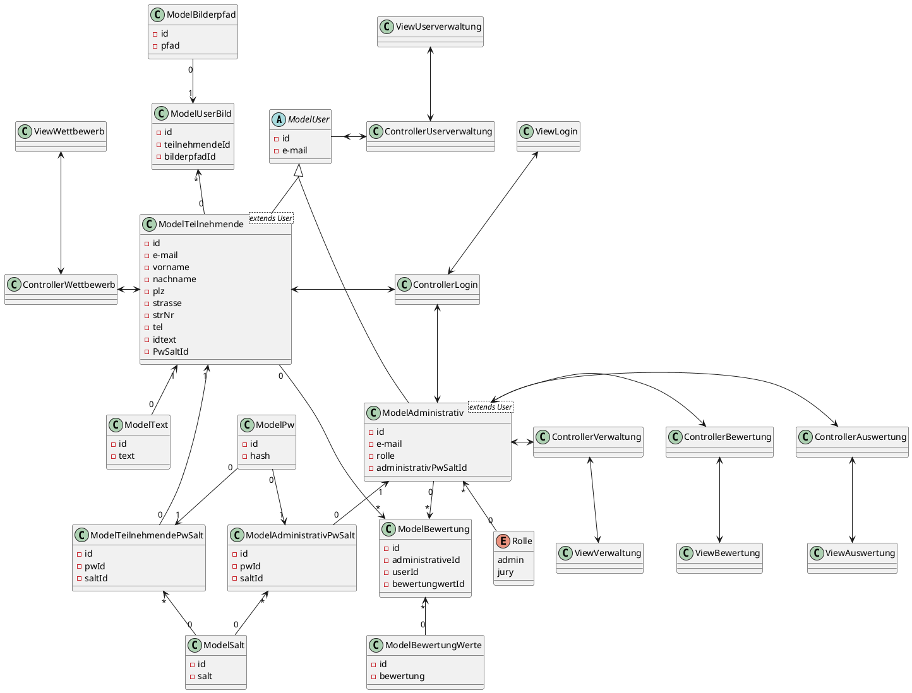

# Model View Controller

## Backend

<!-- tabs:start -->

### **Code - Frontend**

```uml
@startuml
abstract ModelUser {
    - id 
    - e-mail  
}
class ModelTeilnehmende <extends User>{
    - id
    - e-mail
    - vorname
    - nachname
    - plz
    - strasse
    - strNr
    - tel
    - idtext
    - PwSaltId
}

class ModelAdministrativ <extends User> {
    - id
    - e-mail
    - rolle
    - administrativPwSaltId
}
class ModelAdministrativPwSalt{
    - id
    - pwId
    - saltId
}
class ModelTeilnehmendePwSalt{
    - id
    - pwId
    - saltId
}
class ModelPw {
    - id
    - hash
}
class ModelSalt {
    - id
    - salt
}
class ModelBilderpfad {
    - id
    - pfad
}
class ModelUserBild{
    - id
    - teilnehmendeId
    - bilderpfadId
}
class ModelText {
    - id
    - text
}
class ModelBewertung{
    - id
    - administrativeId
    - userId
    - bewertungwertId
}
class ModelBewertungWerte {
    - id
    - bewertung
}
enum Rolle {
    admin
    jury
}


ModelTeilnehmende "1" <-- "0" ModelTeilnehmendePwSalt 
ModelTeilnehmende "0" --> "*" ModelBewertung
ModelTeilnehmende "0" -up-> "*" ModelUserBild
ModelText "0" -up-> "1" ModelTeilnehmende

ModelAdministrativ "1" <-- "0" ModelAdministrativPwSalt
ModelAdministrativ "0" --> "*" ModelBewertung
ModelAdministrativ "*" <-- "0" Rolle

ModelPw "0" --> "1" ModelTeilnehmendePwSalt
ModelPw "0" --> "1" ModelAdministrativPwSalt

ModelSalt "0" -up-> "*" ModelTeilnehmendePwSalt
ModelSalt "0" -up-> "*" ModelAdministrativPwSalt

ModelBilderpfad "0" -down-> "1" ModelUserBild


ModelBewertungWerte "0" -up-> "*" ModelBewertung


skinparam groupInheritance 2

ModelTeilnehmende -up-|> ModelUser
ModelAdministrativ -left-|> ModelUser

ModelAdministrativ <-up-> ControllerLogin
ModelTeilnehmende <-> ControllerLogin

ControllerLogin <-up-> ViewLogin

ModelAdministrativ <-> ControllerVerwaltung
ModelAdministrativ <-> ControllerBewertung
ModelAdministrativ <-> ControllerAuswertung
ModelUser <-> ControllerUserverwaltung

ViewVerwaltung <-up-> ControllerVerwaltung
ViewBewertung <-up-> ControllerBewertung
ViewAuswertung <-up-> ControllerAuswertung
ViewWettbewerb <-down-> ControllerWettbewerb
ViewUserverwaltung <-down-> ControllerUserverwaltung

ModelTeilnehmende <-left-> ControllerWettbewerb

class ControllerLogin{

}
class ControllerBewertung{

}
class ControllerVerwaltung{

}
class ControllerWettbewerb{

}
class ControllerAuswertung{

}
class ControllerUserverwaltung{

}
class ViewLogin {

}
class ViewWettbewerb{

}
class ViewVerwaltung{

}
class ViewBewertung{

}
class ViewAuswertung{

}
class ViewUserverwaltung{

}
@enduml
```

### **Bild - Backend**



<!-- tabs:end -->

## Frontend

<!-- tabs:start -->

### **Code - Frontend**

```uml
@startuml
class AppView{

}
class WettbewerbView{

}
class LoginView{

}
class VerwaltungView{

}
class UserVerwaltungView{

}
class BewertungView{

}
class AuswertungView{

}
class SidebarComponent{

}
class WettbewerbComponent{

}
class LoginComponent{

}
class VerwaltungComponent{

}
class UserVerwaltungComponent{

}
class BewertungComponent{

}
class AuswertungComponent{

}
class WettbewerbStore{

}
class LoginStore{

}
class VerwaltungStore{

}
class UserVerwaltungStore{

}
class BewertungStore{

}
class AuswertungStore{

}

AppView <-- WettbewerbView
AppView <-- LoginView
AppView <-- VerwaltungView
AppView <-- UserVerwaltungView
AppView <-- BewertungView
AppView <-- AuswertungView

LoginView <-down-> LoginStore
LoginView <-> LoginComponent
LoginComponent <-down-> LoginStore
LoginView <--> SidebarComponent
VerwaltungView <-down-> VerwaltungStore
VerwaltungComponent <-> VerwaltungView
VerwaltungComponent <-down-> VerwaltungStore
VerwaltungView <--> SidebarComponent
UserVerwaltungView <-down-> UserVerwaltungStore
UserVerwaltungComponent <-> UserVerwaltungView
UserVerwaltungComponent <-down-> UserVerwaltungStore
UserVerwaltungView <-->SidebarComponent
BewertungView <-down-> BewertungStore
BewertungComponent <-> BewertungView
BewertungComponent <-down-> BewertungStore
BewertungView <--> SidebarComponent
WettbewerbView <-->SidebarComponent
WettbewerbView <-down-> WettbewerbStore
WettbewerbComponent <-> WettbewerbView
WettbewerbComponent <-down-> WettbewerbStore 
AuswertungView <-down-> AuswertungStore
AuswertungComponent <-> AuswertungView
AuswertungComponent <-down-> AuswertungStore
AuswertungView <--> SidebarComponent
APIBackend <-up-> LoginStore
APIBackend <-up-> VerwaltungStore
APIBackend <-up-> UserVerwaltungStore
APIBackend <-up-> BewertungStore
APIBackend <-up-> WettbewerbStore
APIBackend <-up-> AuswertungStore

@enduml
```

### **Bild - Frontend**

```plantuml
@startuml
class AppView{

}
class WettbewerbView{

}
class LoginView{

}
class VerwaltungView{

}
class UserVerwaltungView{

}
class BewertungView{

}
class AuswertungView{

}
class SidebarComponent{

}
class WettbewerbComponent{

}
class LoginComponent{

}
class VerwaltungComponent{

}
class UserVerwaltungComponent{

}
class BewertungComponent{

}
class AuswertungComponent{

}
class WettbewerbStore{

}
class LoginStore{

}
class VerwaltungStore{

}
class UserVerwaltungStore{

}
class BewertungStore{

}
class AuswertungStore{

}

AppView <-- WettbewerbView
AppView <-- LoginView
AppView <-- VerwaltungView
AppView <-- UserVerwaltungView
AppView <-- BewertungView
AppView <-- AuswertungView

LoginView <-down-> LoginStore
LoginView <-> LoginComponent
LoginComponent <-down-> LoginStore
LoginView <--> SidebarComponent
VerwaltungView <-down-> VerwaltungStore
VerwaltungComponent <-> VerwaltungView
VerwaltungComponent <-down-> VerwaltungStore
VerwaltungView <--> SidebarComponent
UserVerwaltungView <-down-> UserVerwaltungStore
UserVerwaltungComponent <-> UserVerwaltungView
UserVerwaltungComponent <-down-> UserVerwaltungStore
UserVerwaltungView <-->SidebarComponent
BewertungView <-down-> BewertungStore
BewertungComponent <-> BewertungView
BewertungComponent <-down-> BewertungStore
BewertungView <--> SidebarComponent
WettbewerbView <-->SidebarComponent
WettbewerbView <-down-> WettbewerbStore
WettbewerbComponent <-> WettbewerbView
WettbewerbComponent <-down-> WettbewerbStore 
AuswertungView <-down-> AuswertungStore
AuswertungComponent <-> AuswertungView
AuswertungComponent <-down-> AuswertungStore
AuswertungView <--> SidebarComponent
APIBackend <-up-> LoginStore
APIBackend <-up-> VerwaltungStore
APIBackend <-up-> UserVerwaltungStore
APIBackend <-up-> BewertungStore
APIBackend <-up-> WettbewerbStore
APIBackend <-up-> AuswertungStore

@enduml
```



<!-- tabs:end -->