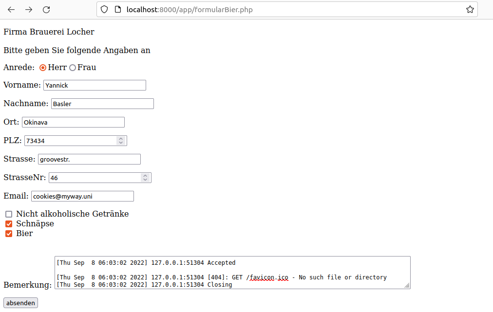
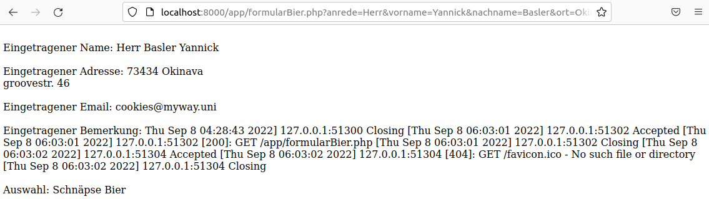

# Bierformular

Ich habe den Auftrag des Bierformulars so gelöst, dass das Formular auf sich ``selbst verweist`` und zugleich ``nicht alles ersichtlich`` ist je nach Situation. Hätte ich mehr Zeit für die Aufgabe gehabt hätte ich wohl mehr Designe in das ganze Formular bringen können. Doch nun habe ich es mehr schlicht gehalten.

<!-- tabs:start -->

#### **Code**

```php
<?php
if (isset($_GET['vorname'])){
echo "</br>Eingetragener Name: ". $_GET['anrede'].' '. $_GET['nachname'].' '. $_GET['vorname'];
echo "</br></br>Eingetragener Adresse: ". $_GET['plz'].' '. $_GET['ort'];
echo "</br>". $_GET['strasse']." ".$_GET['nr'];
echo "</br></br>Eingetragener Email: ". $_GET['email'];
echo "</br></br>Eingetragener Bemerkung: ". $_GET['bemerkung'];
echo "</br></br>Auswahl: ". $_GET['auswahl1']. " ". $_GET['auswahl2']. " ". $_GET['auswahl3'];
}

echo '<form action="formularBier.php" method="get" >';

if(!isset($_GET['vorname'])){
    echo '<p>Firma Brauerei Locher</br></br> Bitte geben Sie folgende Angaben an';
    echo'<p>Anrede:    <input type="radio" name="anrede" value="Herr" <label>Herr</label><input type="radio" name="anrede" value="Frau" <label>Frau</label></p>';
    echo'<p>Vorname:    <input type="text" name="vorname"></p>';
    echo'<p>Nachname:   <input type="text" name="nachname"></p>';
    echo'<p>Ort:        <input type="text" name="ort"></p>';
    echo'<p>PLZ:        <input type="number" name="plz"></p>';
    echo'<p>Strasse:    <input type="text" name="strasse"></p>';
    echo'<p>StrasseNr:  <input type="number" name="nr"></p>';
    echo'<p>Email:  <input type="email" name="email"></p>';
    echo'<input type="checkbox" id="auswahl1" name="auswahl1" value="Nicht alkoholische Getränke">
    <label for="auswahl1"> Nicht alkoholische Getränke</label><br>
    <input type="checkbox" id="auswahl2" name="auswahl2" value="Schnäpse">
    <label for="auswahl2"> Schnäpse</label><br>
    <input type="checkbox" id="auswahl3" name="auswahl3" value="Bier">
    <label for="auswahl3"> Bier</label><br><br>';
    echo'<p>Bemerkung:  <textarea name="bemerkung" rows="4" cols="100"></textarea></p>';

    echo '<input type="submit" value="absenden">';
}
?>
</form>
```

#### **Formular zum Ausfüllen**



#### **Formular versendet**



<!-- tabs:end -->