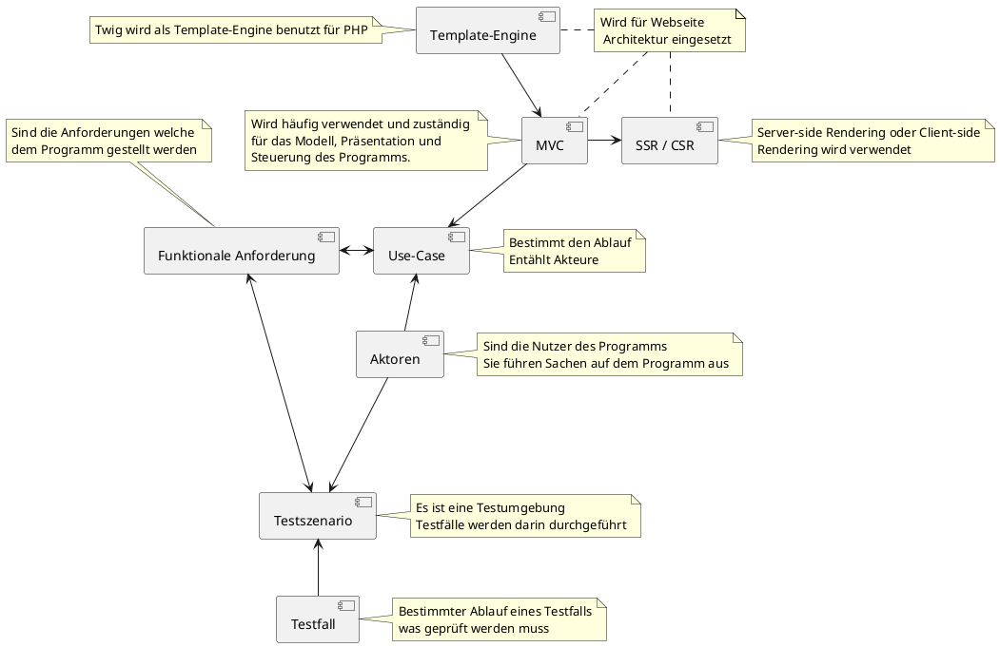

# Concept Map

```plantuml
@startuml
[SSR / CSR]
[MVC]
[Template-Engine]
[Use-Case]
[Aktoren]
[Funktionale Anforderung]
[Testszenario]
[Testfall]

[MVC]->[SSR / CSR]
[Template-Engine]-down->[MVC]
[MVC]-->[Use-Case]
[Use-Case]<--[Aktoren]
[Aktoren]--->(Testszenario)
[Funktionale Anforderung]<->[Use-Case]
[Funktionale Anforderung]<-->(Testszenario)
[Testszenario]<--[Testfall]
[Testszenario]

note right of [SSR / CSR]
    Server-side Rendering oder Client-side
    Rendering wird verwendet
end note

note left of (MVC)
    Wird häufig verwendet und zuständig 
    für das Modell, Präsentation und 
    Steuerung des Programms.
end note

note right of (Use-Case)
    Bestimmt den Ablauf
    Entählt Akteure
end note

note left of (Template-Engine)
    Twig wird als Template-Engine benutzt für PHP
end note

note right of (Aktoren)
    Sind die Nutzer des Programms
    Sie führen Sachen auf dem Programm aus
end note

note top of (Funktionale Anforderung)
    Sind die Anforderungen welche 
    dem Programm gestellt werden
end note 

note right of (Testszenario)   
    Es ist eine Testumgebung 
    Testfälle werden darin durchgeführt
end note

note right of (Testfall)   
    Bestimmter Ablauf eines Testfalls
    was geprüft werden muss
end note

note "Wird für Webseite \n Architektur eingesetzt" as Architektur

Architektur .. [SSR / CSR]
Architektur .. (MVC)
(Template-Engine) . Architektur
@enduml
```