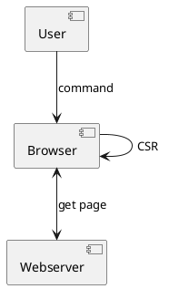
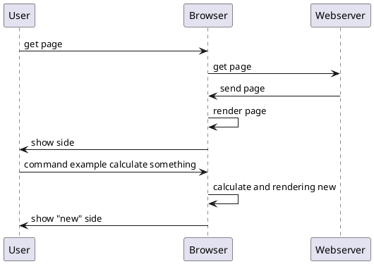
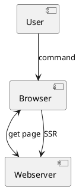
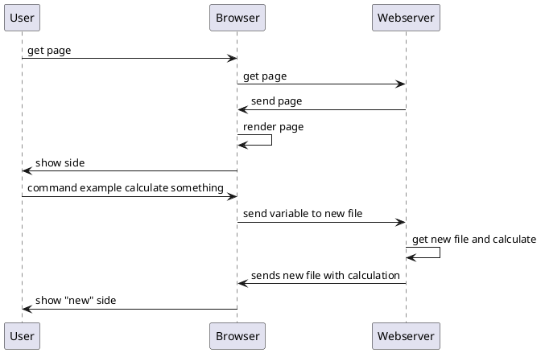

# CSR und SSR

## CSR

CSR heisst ausgeschrieben ``Client Side Rendering``. Das heisst, dass Abläufe direkt in dem mitgegebenen File der Seite sich selbst wieder anspricht bei gewissen Ausführungen und daher der eigene Browser die Arbeit erledigt. Dies kann vorteilhaft sein, dass der Datenverkehr nicht so hoch ist. Doch so braucht der eigene Rechner mehr Ressourcen, um verschiedene Tasks auf der dargestellten Seite auszuführen.

## CSR Diagramm

<!-- tabs:start -->

#### **COMPONENT DIAGRAM**

#### **SEQUENCE DIAGRAM**

<!-- tabs:end -->

## SSR

SSR steh für ``Server Side Rendering``. Bei dieser Methode erhält man zu Beginn ein File, welches dann bei weiterführenden **Aktionen** auf ein ``anderes File verweist``. So wird der Server nochmals angesprochen und zugleich auch Daten übermittelt, diese er dann verarbeitet und gegebenenfalls wieder zurück an den User sendet zur Darstellung. So wird der User weniger mit Code belastet, doch entsteht auch ein höherer Datenverkehr und grössere Belastung des Servers.

<!-- tabs:start -->

#### **COMPONENT DIAGRAM**

#### **SEQUENCE DIAGRAM**

<!-- tabs:end -->