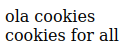

# Dateien Auslesen

## Funktion file_get_contents

Mit dem Befehl ``file_get_contents('beispiel.txt')`` können die gesammten Inhalte einer Datei in einer Variablen gespeichert werden.

## Ausgabe

Wird die Variable mit einem **echo-befehl** ausgegeben so wird der Text in einer Zeile ausgegeben. Da php den Text als **HTML** ausgibt werden Zeilenumbrüche nicht genommen, wenn man jedoch den Befehl ``echo nl2br($variable)`` verwendet fügt die Funktion **nl2br** bei den Zeilenumbrüchen ein ``<br />`` hinzu. Dadurch wird dann bei der HTML Darstellung die Umbrüche angezeigt.

### Beispiel

<!-- tabs:start -->
#### **Datei in Variable**

```php
<?php
$file = file_get_contents('/files/beispiel.txt');
echo $file;
?>
```

#### **Ausgabe Echo**


#### **Code mit nl2br**

```php
<?php
$file = file_get_contents('/files/beispiel.txt');
echo nl2br($file);
?>
```

#### **Ausgabe mit nl2br**



#### **beispiel.txt**

```txt
ola cookies
cookies for all
```

<!-- tabs:end -->

## Dateien zeilenweise ausslesen

Mit der Funktion ``file`` wird eine Datei zeilenweise ausgelesen und jede einzelne Zeile wird in einem Array-element gespeichert. Somit kann auch gezielt eine bestimmte Zeile ausgegeben werden.

### Beispiel Zeilenausgabe

<!-- tabs:start -->
#### **Code**

```php
<?php
$file = file('/files/beispiel.txt');
echo $file[1];
?>
```

#### **Ausgabe**


#### **beispiel.txt**

```txt
ola cookies
cookies for all
```


<!-- tabs:end -->