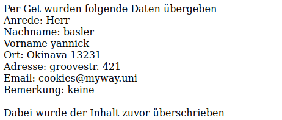

# Dateien schreiben

## Funktion file_put_contents

Bei der Funktion ``file_put_contents('beispiel.txt', '$variable')`` werden zwei Argumente erwartet. Erstens wird der Dateiname erwartet, existiert die Datei noch nicht, wird diese erstellt. Andernfalls werden die Daten in dieser Datei mit dem Inhalt welchen man übergibt überschrieben. Das zweite Argument verlangt den Inhalt (eine Variable) der in die Datei gespeichert werden soll.

Als Beispiel können Daten die per Get geholt wurden so in ein Dokument überschrieben werden.

> [!ATTENTION]
> Der Inhalt einer Datei wird überschrieben

### Beispiel

<!-- tabs:start -->
#### **Code**

```php
<?php
$file = file_get_contents('beispiel1.txt');
echo $file;

$anrede = $_GET['anrede'];
$nachname = $_GET['nachname'];
$vorname = $_GET['vorname'];
$plz = $_GET['plz'];
$ort = $_GET['ort'];
$strasse = $_GET['strasse'];
$nr = $_GET['nr'];
$email = $_GET['email'];
$bemerkung = $_GET['bemerkung'];

$übergabe = "Per Get wurden folgende Daten übergeben <br />Anrede: $anrede <br />Nachname: $nachname <br />Vorname $vorname <br />Ort: $ort $plz <br />Adresse: 
$strasse $nr <br />Email: $email <br />Bemerkung: $bemerkung  <br /> <br /> Dabei wurde der Inhalt zuvor überschrieben";
file_put_contents('beispiel1.txt', $übergabe);

echo '<form action="formularBier.php" method="get" >';

if(!isset($_GET['vorname'])){
    echo '<p>Firma Brauerei Locher</br></br> Bitte geben Sie folgende Angaben an';
    echo'<p>Anrede:    <input type="radio" name="anrede" value="Herr" <label>Herr</label><input type="radio" name="anrede" value="Frau" <label>Frau</label></p>';
    echo'<p>Vorname:    <input type="text" name="vorname"></p>';
    echo'<p>Nachname:   <input type="text" name="nachname"></p>';
    echo'<p>Ort:        <input type="text" name="ort"></p>';
    echo'<p>PLZ:        <input type="number" name="plz"></p>';
    echo'<p>Strasse:    <input type="text" name="strasse"></p>';
    echo'<p>StrasseNr:  <input type="number" name="nr"></p>';
    echo'<p>Email:  <input type="email" name="email"></p>';
    echo'<input type="checkbox" id="auswahl1" name="auswahl1" value="Nicht alkoholische Getränke">
    <label for="auswahl1"> Nicht alkoholische Getränke</label><br>
    <input type="checkbox" id="auswahl2" name="auswahl2" value="Schnäpse">
    <label for="auswahl2"> Schnäpse</label><br>
    <input type="checkbox" id="auswahl3" name="auswahl3" value="Bier">
    <label for="auswahl3"> Bier</label><br><br>';
    echo'<p>Bemerkung:  <textarea name="bemerkung" rows="4" cols="100"></textarea></p>';

    echo '<input type="submit" value="absenden">';
}
?>
</form>
```

#### **Ausgabe der Datei**



#### **beispiel1.txt vor dem überschreiben**

```txt
ola cookies
cookies for all
```

#### **beispiel1.txt nach dem überschreiben**

```txt
Per Get wurden folgende Daten übergeben <br />Anrede: Herr <br />Nachname: basler <br />Vorname yannick <br />Ort: Okinava 13231 <br />Adresse: groovestr. 421 <br />Email: cookies@myway.uni <br />Bemerkung: keine  <br /> <br /> Dabei wurde der Inhalt zuvor überschrieben
```

<!-- tabs:end -->

## Text an Datei anhängen

Will man eine Datei nicht **überschreiben** sondern ein Text **hinzufügen**, kann man dies mit einem **dritten Argument** bewerkstelligen. Dieses Argument heisst ist ``FILE_APPEND``.

```php
<?php
$Beispiel = "Beispiel zum Anhang";
file_put_contents('beispiel1.txt', $name, FILE_APPEND);
?>
```
