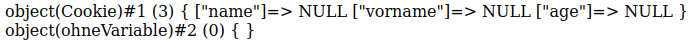
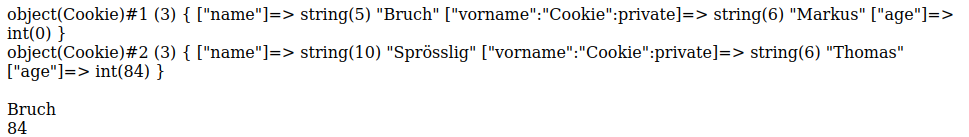
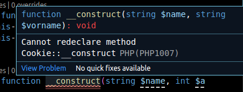
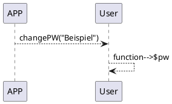

# KMK

## Konstuktor

PHP verwendet als Konstruktor die Methode ``__construct()`` wird dieser nicht selbst erstellt mit gezielten Variablen, so erstellt PHP selbst eine Variable. Diese beinhaltet das Erstellungsdatum des Objektes, die Variable ist nicht ansprechbar.

<!-- tabs:start -->

### **Code**

```php
<?php
    class Cookie {
        public $name;
        public $vorname;
        public $age;
    }
    class ohneVariable{

    }
    $test = new Cookie();
    $test2 = new ohneVariable();
    echo var_dump($test);
    echo "<br />";
    echo var_dump($test2);
?>
```

### **Ausgabe**



<!-- tabs:end -->

Die Methode ``__construct()`` wird ebenfalls verwendet um sein eignen Konstruktor mit Variablen zu erstellen.

<!-- tabs:start -->

### **Code**

```php
<?php
    class Cookie {
        public string $name;
        private string $vorname;
        public int $age;
        
        public function __construct(string $name, string $vorname, int $age = 0){
            $this->name = $name;
            $this->vorname = $vorname;
            $this->age = $age;
        }
    }
    $test = new Cookie("Bruch","Markus");
    $test2 = new Cookie("Sprösslig", "Thomas", 84);
   
    echo var_dump($test);
    echo "<br />";
    echo var_dump($test2);
    echo "<br /><br />";
    echo "$test->name <br />";
    echo $test2->age;
?>
```

### **Ausgabe**



<!-- tabs:end -->

Bei meinem Beispiel ist der Wert für **age** mit einem default belegt. Wenn also kein Alter mitgegeben wird, so wird automatisch der Default-Wert eingetragen und die Initialisierung funktioniert trotzdem.  

Leider ist das Überladen eines Konstruktors nicht möglich.  



## Methode  

Methoden sind funktionen die in den jeweiligen Klassen selbst definiert werden. Diese Methoden führen funktionen auf der Klasse basierend aus. So können z.B Daten die auf der Klasse als **Private** definiert sind bearbeitet werden, solang die Methode als **Public** definiert ist.  
Wird eine Methode nicht mit einem Zugrriffsmodifizierer(private, protected, public) definiert, so wird default-technisch die Methode **Public** gesetzt. Es wird aber empfohlen diese immer selbst zu setzen.  

<!-- tabs:start -->

### **Code**

```php
<?php
class User{
    private string $Username;
    private string $pw;

    public function changePw(string $pw){
        $this->pw = $pw;
    }
}
?>
```

### **Logic**



<!-- tabs:end -->

## Klasse

Klassen werden in PHP verwendet um eigene Methoden und Eigenschaften eines definierten Objektes zu erstellen. Mit einem Konstruktor innerhalb der Klassen können die Objekte initalisiert werden.  

<!-- tabs:start -->

### **Code**

```php
<?php
class Beispiel
{
    private string $name;
    private string $vorname;
    private float $groesse;

    public function __construct(string $name, string $vorname, float $groesse){
        $this->name=$name;
        $this->vorname=$vorname;
        $this->groesse=$groesse;
    }

    public function getName(){
        return $this->name;
    }

    public function getVorname(){
        return $this->vorname;
    }
    public function getGroesse(){
        return $this->groesse;
    }
}

$beispiel = new Beispiel("Kender","Markus", 1.77);
echo "<br>"."<br>".$beispiel->getName()."<br>";
echo $beispiel->getVorname()."<br>";
echo $beispiel->getGroesse()."<br>";
?>
```

### **Ausgabe**

  

<!-- tabs:end -->