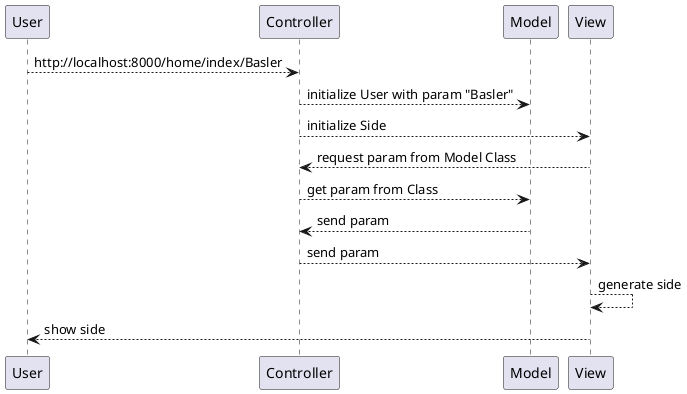
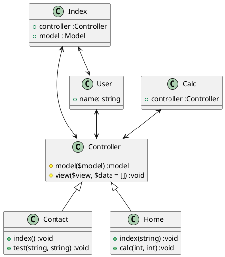
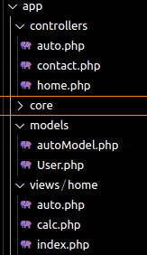

# MVC 101

Dieses Projekt ist ein Beispiel wie wir die URL verwenden und darstellen wollen für den Ablauf des [MVC](tech/mvc.md).  

<!-- tabs:start -->

## **Sequenzdiaramm Webseitenaufruf**



## **Klassendiagramm Framework**



<!-- tabs:end -->

## Autoerweiterung

Um die Autoerweiterung durchzuführen wurden folgende files erstellt, damit diese ebenfalls aufgerufen werden können. Es wurde ein autoModel benötigt ein auto-Controller und eine autoView.  



<!-- tabs:start -->

### **Model**

```php
<?php

class Auto{
    private string $name;
    private string $color;
    private int $doors;

    function setName(string $name){
        $this->name=$name;
    }
    function setColor(string $color){
        $this->color=$color;
    }
    function setDoors(int $doors){
        $this->doors= $doors;
    }
    function getName(){
        return  $this->name;
    }
    function getColor(){
        return $this->color;
    }
    function getDoors(){
        return $this->doors;
    }
}
```

### **Controller**

```php
public function auto($name , $color , $doors)
    {
        $car = $this->model('Auto');
        $car->setName($name);
        $car->setColor($color);
        $car->setDoors($doors);

        $this->view('home/auto', ['name' => $car->getName(),'color' => $car->getColor(), 'doors' => $car->getDoors()]);
    }
```

### **View**

```php
Das Automodell heisst  <?=$data['name']?> hat die Farbe <?=$data['color']?> und hat <?=$data['doors']?> Türen.
```

<!-- tabs:end -->