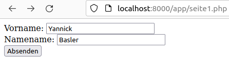
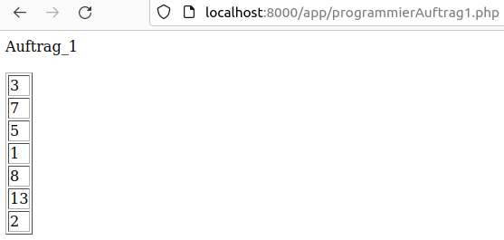

# PHP Aufgaben

## Tag 1 - Erste Schritte

Um in PHP ein Code zu schreiben. Wird der Code mit ``<?php`` begonnen und endet auf ``?>``.

<!-- tabs:start -->

#### **PHP Info**

```php
<?php
phpinfo();
?>
```

#### **Echo**

```php
<?php
echo "Hello World. Some cookies?";
?>
```

Output:

`Hello World. Some cookies?`

#### **Kommentare**

```php
<?php
// dies ist ein kommentarzeile
echo "ola";
// dies ist ebenfalls eine kommentarzeile

/* Mehere Zeilen Kommentar
asd
dsada
adasda
*/
?>
```

Output:

`ola`

#### **Variablen**

```php
<?php
$ola = "Cookies für alle!!!!";

echo $ola.$ola;
?>
```

Output:

`Cookies für alle!!!!Cookies für alle!!!!`

<!-- tabs:end -->

## Tag 2

### Rechnen mit Variablen

Wie auch in anderen Programmiersprachen werden beim Speichern von Zahlen keine **" "** verwendet, da sonst die Variable zu einem String wird statt eines int oder double und daher auch nicht rechnerisch verwendet werden können.

<!-- tabs:start -->

#### **Variable mit Zahl**

#### Code

```php
<?php
$zahl1 = 10;
$zahl2 = 5;
echo "Zahl1: $zahl1 <br />";
echo "Zahl2: $zahl2";
?>
```

#### Output:

```html
Zahl1: 10
Zahl2: 5
```

#### **Zahlen addieren**


#### Code

```php
<?php
$zahl1 = 10;
$zahl2 = 5;
$ergebnis = $zahl1 + $zahl2;
echo "Ergebnis: $ergebnis";
?>
```

#### Output:

```html
Ergebnis: 15
```  

#### **Zahlen addieren 2**

#### Code

```php
<?php
$zahl = 1;
$ergebnis = $zahl + 5;
echo $ergebnis;
?>
```

#### Output:

```html
6
```  

#### **Rechenmethoden**

#### Code

```php
<?php
$zahl1 = 10;
$zahl2 = 5;
echo $zahl1 + $zahl2; //addieren
echo "<br />";
echo $zahl1 - $zahl2; //subtrahieren
echo "<br />";
echo $zahl1 * $zahl2; //multiplizieren
echo "<br />";
echo $zahl1 / $zahl2; //dividieren
echo "<br />";
echo pow($zahl1,$zahl2); //Zahl1 hoch Zahl2 (10^5)
echo "<br />";
echo sqrt(64); // Wurzel von 64
echo "<br />";
echo 2*$zahl1 + 5*$zahl2 - 3; //Berechnet 2*10 + 5*5 - 3
?>
```

#### Output:

```html
15  
5  
50  
2
100000
8  
42  
```

<!-- tabs:end -->

### Get & Post

Die **Get & Post** Methode wird verwendet um Daten von einer API-Schnittstelle zur andern zu transferieren. Dies sollte durch das letze Semester und dem Projekt verständlich sein.

<!-- tabs:start -->

#### **Get**

Die **Get-Methode** übermittelt die Informationen direkt in der URL und sind daher auch direkt zu lesen.

```url
Migrosbank.php?accountname=blackrose&password=cookies
```

#### **Post**

Die **Post-Methode** übermittelt die Informationen über eine Datei, gerne wird dabei .Json verwendet oder auch mal noch gerne XML.

```XML
<form action="seite2.php" method="post">
Vorname: <input type="text" name="vorname" /><br />
Namename: <input type="text" name="nachname" /><br />
<input type="Submit" value="Absenden" />
</form>
```

```php
<?php
$vorname = $_POST["vorname"];
$nachname = $_POST["nachname"];
echo "Hallo $vorname $nachname";
?>
```




<!-- taps:end -->

### Arrays

<!-- taps:start -->

#### **Generell**

Arrays können beliebig viele Werte gespeichert werden und wieder ausgegeben werden. Für ein bestimmten Wert des Arrays muss die richtige Indexstelle angeben werden.

```php
<?php
$wochentage = array("Sonntag","Montag","Dienstag",
"Mittwoch","Donnerstag","Freitag","Samstag");
echo $wochentage[1];
?>
```

#### **Assoziativ**

Bei diesem verfahren wird dem Index des Arrays auch ein Key hinterlegt, welcher dazu dienen soll Werte die man wiedergeben will leichter abzurufen. Da der Zahlenindex ab einer gewissen Menge unübersichtlich wird im gegensatz zu einem Key-System, welches man sich selbst ausgedacht hat.

```php
<?php
$wochentage = array(
"so" => "Sonntag",
"mo" => "Montag",
"di" => "Dienstag",
"mi" => "Mittwoch",
"do" => "Donnerstag",
"fr" => "Freitag",
"sa" => "Samstag");

echo $wochentage["mo"];
?>
```

#### **Mehrdimensional**

Man kann Arrays auch verschachteln. Das soll heissen, dass ich in einem Array ein weiteren Array einbinden kann. Dies kann behilflich sein, wenn mehrere Werte zu einem selbigen Objekt gehören aber dennoch voneinander abrufbar sein sollten.

```php
<?php
$mitarbeiter = array(
  array("Klaus", "Zabel"),
  array("Arnie", "Meier"),
  array("Willi", "Brand")
);

//Daten ausgeben
echo "Vorname: ".$mitarbeiter[0][0];
echo " Nachname: ".$mitarbeiter[0][1];
?>
```

<!-- taps:end -->


### Programmierauftrag 1

```php
<?php
echo "Auftrag_1 <br /><br />";
$array = array(3,7,5,1,8,13,2);
?>

<table border="solid">
    <tbody>
    <?php 
        foreach ($array as $value) {
            echo "<tr>";
                echo "<td>". $value . "</td>";
            echo "</tr>";
        }
    ?>
    </tbody>
</table>
```

