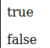

# == ≠ ===

Bei der Verwendung dieser Operatoren muss man sich bewusst sein, dass ``==`` den Inhalt der beiden Variablen auf gleichheit prüft und ``===`` überprüft die Referenzpunkte der beiden Variablen.

<!-- tabs:start -->

#### **Code**

```php
<?php
$test1 = (int)100;
$test2 = '100';
if ($test1 == $test2){
    echo "<p>true</p><br />";
}
else {
    echo "<p>false</p><br />";
};

if ($test1 === $test2){
    echo "<p>true</p><br />";
}
else {
    echo "<p>false</p><br />";
};
?>
```

#### **Ausgabe**



<!-- tabs:end -->

Das heisst wenn der Wert gleich ist müssen die Datentypen bei ``==`` nicht übereinstimmen, dies kann zu verherrenden Fehlern führen. Zugleich heisst es für meine Logik aber auch, falls zwei gleiche Werte mit selbigen Datentyp vorhanden sind aber an zwei Unterschiedlichen Referenzpunkten sein sollten wird auch bei ``===`` ein **False** ausgeben.
