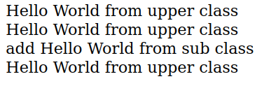

# Vererbung

Bei Vererbung wird von einer ``Oberklasse`` alle Elemente an die ``Subklasse`` vererbt. Diese vererbten Elemente können so wieder verwendet werden als Beispiel mache ich eine Methode in der Oberklasse die ein Echo ausgibt. Diese Methoden können aber auch überschrieben werden in der Subklasse oder in der Methode selsbt wieder die Methode der Oberklasse aufrufen mit dem Befehl ***parent::*** . Eine ``Subklasse`` wird mit dem Vermerk ***extends*** zur **Oberklasse** verwiesen.

<!-- tabs:start -->

## **Code**

```php
<?php
class OberKlasse {
    public function helloWorld(){
        echo "Hello World from upper class <br />";
    }
}

class SubKlasse1 extends OberKlasse {
    public function helloWorld(){
        parent::helloWorld();
        echo "add Hello World from sub class <br />";
    }
}

class SubKlasse2 extends OberKlasse {
    // no changes
}

// initalisierung
$oberKlasseObj = new OberKlasse();
$subKlasse1Obj = new SubKlasse1();
$subKlasse2Obj = new SubKlasse2();

//aufruf der Methode
$oberKlasseObj->helloWorld();
$subKlasse1Obj->helloWorld();
$subKlasse2Obj->helloWorld();
?>
```

## **Ausgabe**

  

<!-- tabs:end -->